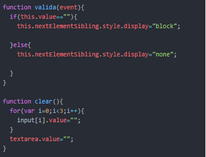

# Freelancer

El trabajo consistio en replicar el [website](https://blackrockdigital.github.io/startbootstrap-freelancer/).
Para ello use flexbox para la maquetación.Se piden las siguientes funcionalidades:
- Al hacer scroll, este evento hará que el padding de esta section disminuya y el tamaño de fuente del h1; al regresar al punto cero; se vuelve a vissualizar como al inicio.
- Hay un modal de fotos, al hacer click ocupará toda la pantalla y tendra su propio scroll.
- Tenemos un formulario que debe estar validado; en este ejercicio al no estar debidamente completado aparece un texto debajo de cada input, indicando el error. En este proyecto se ha bloqueado el teclado númerico para el input nombre y el teclado de texto para el teléfono.

## Funcionalidades en JS
------------------------

### Function scroll.
 Esta función se encarga de hacer cambios de acuerdo al evento scroll, así si colocamos la section about, en el navegador este "boton" cambiará de background-color y color de texto. A continuación la función:

### Funcionalidad del modal.
 Esta función llama al modal que se encuentra oculto y utiliza el target para detectar quien es el objetivo de esta llamada, en este caso sera su "nextElementSibling" (hermano en el DOM).

### Function de validación.
Esta función se encarga de validar el correcto llenado del formulario, de estar completo se vaciaran los casilleros. Se usan los eventos keypress, blur y click. Se muestra sólo una parte de la función a continuación

## Autor: Stephanie Hiyagon.
